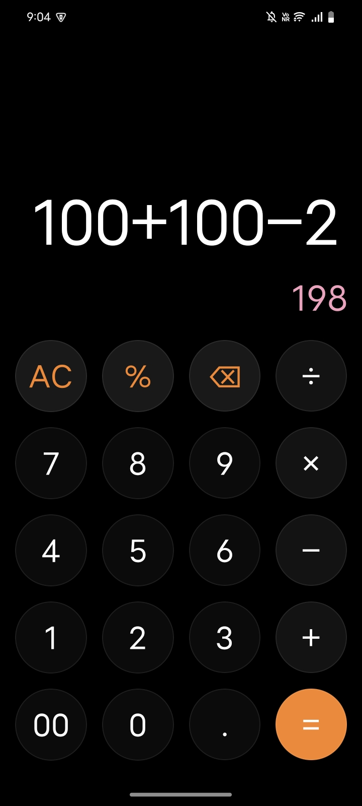

# GlassiCal 🧮✨

**The Art of Calculation.**

GlassiCal is a modern Android calculator application that brings the stunnnig **Glassmorphism** design language to your fingertips. It combines a beautiful, frosted-glass aesthetic with robust functionality and privacy-conscious engineering.

<!--  -->

## Why GlassiCal?

*   **💎 Stunning UI:** A sleek, transparent, and blurry aesthetic that stands out from the crowd.
*   **📱 Adaptive Design:** Features a "Liquid Layout" that automatically adjusts padding for devices with Gesture Navigation or 3-Button Navigation bars.
*   **⚡ Live Preview:** See your results instantly as you type.
*   **🔒 Privacy Focused:** Requires **zero** dangerous permissions. No internet, no analytics.
*   **👐 Open Source:** Fully open source and licensed under GPLv3.

## Screenshots

  
  
  

## License

This project is licensed under the **GNU General Public License v3.0**.
See the [LICENSE](LICENSE) file for details.

---
*Built with ❤️ by rehan*
